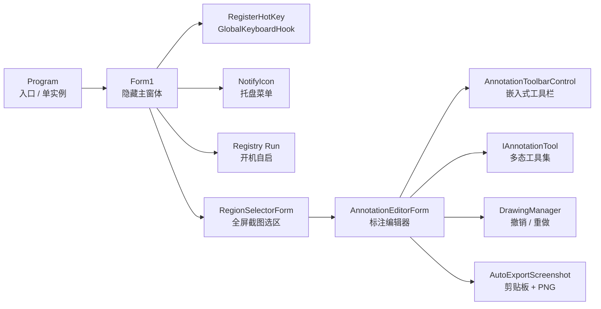
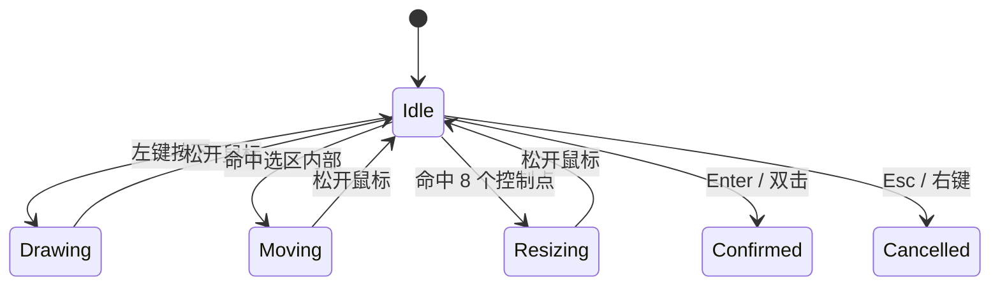

# PrintScreenApp

<div class="cover-stage">
  <div class="cover-copy">
    <div class="eyebrow">PROJECT DEFENSE · C# DESKTOP UTILITY</div>
    <h1>PrintScreenApp</h1>
    <p class="cover-subtitle">基于 .NET 8 / Windows Forms 的截图与标注工具</p>

    <div class="cover-tags">
      <span v-click>Global Hotkey</span>
      <span v-click>GDI+ Capture</span>
      <span v-click>Tool Polymorphism</span>
      <span v-click>Auto Export</span>
    </div>
  </div>

  <div v-click class="product-panel">
    <div class="window-bar">
      <span></span><span></span><span></span>
      <b>AnnotationEditorForm.cs</b>
    </div>
    <div class="screen-area">
      <div class="selection-box">
        <i></i><i></i><i></i><i></i>
        <strong>1280 × 720</strong>
      </div>
      <div class="toolbar-strip">
        <em></em><em></em><em></em><em></em><em></em><em></em>
      </div>
    </div>
  </div>
</div>

<div class="abs-bl pl-10 pb-8 text-sm opacity-60">
Windows Forms · Win32 API · GDI+ · Registry · Interface
</div>

---
layout: center
---

# 我会怎么讲这个项目

<div class="agenda">
  <div v-click><b>项目为什么做</b><span>截图工具的真实使用场景和目标</span></div>
  <div v-click><b>整体怎么跑</b><span>从启动到保存的完整调用链</span></div>
  <div v-click><b>C# 知识点</b><span>类、对象、接口、委托事件、异常、资源释放</span></div>
  <div v-click><b>关键代码</b><span>热键、状态机、GDI+、工具多态、注册表自启</span></div>
  <div v-click><b>亮点和路线图</b><span>最近更新、工程细节、v2.0 / v3.0 迭代计划</span></div>
</div>

---

# 项目定位

<div class="split">
  <div>
    <h2>用户看到的是一个截图工具</h2>
    <div class="stack-list">
      <div v-click>按快捷键或双击托盘图标开始截图</div>
      <div v-click>鼠标拖拽选择区域，可以移动和缩放</div>
      <div v-click>进入标注界面，选择画笔、箭头、高亮、橡皮擦</div>
      <div v-click>保存后自动复制到剪贴板并写入本地图片目录</div>
    </div>
  </div>

  <div>
    <h2>代码背后是桌面系统能力的整合</h2>
    <div class="mini-grid">
      <div v-click>WinForms 窗体生命周期</div>
      <div v-click>Win32 热键与消息</div>
      <div v-click>GDI+ 图像绘制</div>
      <div v-click>JSON 配置持久化</div>
      <div v-click>注册表开机自启</div>
      <div v-click>接口多态扩展工具</div>
    </div>
  </div>
</div>

---

# 最近代码更新可以重点讲

<div class="release-grid">
  <div v-click>
    <b>开机自启</b>
    <span>使用 `Microsoft.Win32.Registry` 写入当前用户 Run 项</span>
  </div>
  <div v-click>
    <b>托盘入口简化</b>
    <span>双击托盘直接截图，应用默认隐藏运行</span>
  </div>
  <div v-click>
    <b>工具栏改造</b>
    <span>`AnnotationToolbarControl` 从独立窗体改成嵌入式控件</span>
  </div>
  <div v-click>
    <b>标注工具扩展</b>
    <span>新增 Highlighter 和 Eraser，体现接口扩展能力</span>
  </div>
</div>

---

# 整体架构



<div v-click class="speaker-note">
讲法：主窗体不是传统意义上的页面，而是一个后台协调器。真正的用户交互发生在选区窗体和标注窗体里。
</div>

---

# 完整函数调用链

<div class="call-chain">
  <div v-click><b>Program.Main</b><span>创建 Mutex，初始化 WinForms</span></div>
  <div v-click><b>Form1.InitializeHotKey</b><span>注册热键，安装低级键盘钩子</span></div>
  <div v-click><b>WndProc / KeyPressed</b><span>收到触发后调用 StartRegionScreenshot</span></div>
  <div v-click><b>RegionSelectorForm.ShowDialog</b><span>全屏截图并返回选区 Bitmap</span></div>
  <div v-click><b>AnnotationEditorForm.ShowDialog</b><span>把 Bitmap 交给标注工具编辑</span></div>
  <div v-click><b>AutoExportScreenshot</b><span>复制剪贴板，保存到 Pictures</span></div>
</div>

---

# 类与对象：谁负责什么

| 类 / 对象 | 角色 | 关键职责 |
| --- | --- | --- |
| `Program` | 程序入口 | 单实例、消息注册、启动主窗体 |
| `Form1` | 后台协调器 | 托盘、热键、截图流程、开机自启 |
| `RegionSelectorForm` | 选区对象 | 捕获屏幕、管理鼠标状态、输出选区图 |
| `AnnotationEditorForm` | 编辑器对象 | 管理画布、工具栏、当前工具和历史状态 |
| `AnnotationToolbarControl` | 工具栏对象 | 图标按钮、事件派发、拖动定位 |
| `DrawingManager` | 历史管理对象 | 保存快照、撤销、重做 |
| `IAnnotationTool` | 工具抽象 | 统一鼠标事件、预览和提交协议 |

---

# 知识点 1：单实例与窗口消息

<div class="code-frame">

```csharp {all|4|7-8|10-15|all}
[STAThread]
static void Main()
{
    ShowAppMessageId =
        RegisterWindowMessage("PrintScreenApp_ShowWindow_Message");

    using Mutex mutex = new(true, SingleInstanceMutexName,
                            out bool createdNew);

    if (!createdNew)
    {
        PostMessage(new IntPtr(0xFFFF), ShowAppMessageId,
                    IntPtr.Zero, IntPtr.Zero);
        return;
    }

    Application.Run(new Form1());
}
```

</div>

<div class="knowledge-row">
  <div v-click>`Mutex`：保证只有一个实例运行</div>
  <div v-click>`RegisterWindowMessage`：注册跨进程消息</div>
  <div v-click>`PostMessage`：重复启动时通知已有实例</div>
</div>

---

# 知识点 2：托盘后台常驻

<div class="split">
<div>

```csharp {all|1-6|8-15|17-20|all}
ContextMenuStrip contextMenu = new();
contextMenu.Items.Add("立即截图", null,
    (_, _) => BeginInvoke(new Action(StartRegionScreenshot)));
contextMenu.Items.Add("设置快捷键…", null,
    (_, _) => OpenHotKeySettings());
contextMenu.Items.Add("退出", null, (_, _) => ExitApplication());

_trayIcon = new NotifyIcon
{
    Icon = SystemIcons.Application,
    Text = "PrintScreenApp",
    Visible = true,
    ContextMenuStrip = contextMenu
};

_trayIcon.DoubleClick += (_, _) =>
    BeginInvoke(new Action(StartRegionScreenshot));

ShowInTaskbar = false;
Opacity = 0;
WindowState = FormWindowState.Minimized;
```

</div>
<div>
  <div class="explain-card" v-click>
    <b>对象</b>
    <span>`NotifyIcon` 是系统托盘图标对象，`ContextMenuStrip` 是右键菜单对象。</span>
  </div>
  <div class="explain-card" v-click>
    <b>事件</b>
    <span>菜单点击和托盘双击都绑定到 `StartRegionScreenshot`。</span>
  </div>
  <div class="explain-card" v-click>
    <b>线程安全</b>
    <span>`BeginInvoke` 把操作切回 WinForms UI 消息队列执行。</span>
  </div>
</div>
</div>

---

# 知识点 3：全局热键与 Win32 API

<div class="split">
<div>

```csharp {all|1-3|7|10-17|all}
[DllImport("user32.dll", SetLastError = true)]
private static extern bool RegisterHotKey(
    IntPtr hWnd, int id, uint fsModifiers, uint vk);

private void InitializeHotKey()
{
    DisposeHotKeys();
    const uint MOD_NOREPEAT = 0x4000;

    for (int i = 0; i < _hotKeyConfig.Entries.Count; i++)
    {
        HotKeyEntry entry = _hotKeyConfig.Entries[i];
        int id = 0xB000 + i;
        uint mod = (uint)entry.GetModifiers() | MOD_NOREPEAT;

        RegisterHotKey(Handle, id, mod, (uint)entry.Key);
    }
}
```

</div>
<div>
  <h2>这页体现什么 C# 能力</h2>
  <div class="stack-list compact">
    <div v-click>平台调用：`DllImport` 让 C# 调用 user32.dll</div>
    <div v-click>集合对象：`List&lt;int&gt;` 保存已注册的热键 id</div>
    <div v-click>配置对象：`HotKeyEntry` 封装 Ctrl / Alt / Win / Key</div>
    <div v-click>位运算：修饰键枚举组合成 Win32 需要的值</div>
  </div>
</div>
</div>

---

# 知识点 4：低级键盘钩子

<div class="code-frame">

```csharp {all|1-3|5-12|14-19|all}
public sealed class GlobalKeyboardHook : IDisposable
{
    public Func<int, bool, bool, bool, bool, bool>? Matcher { get; set; }
    public event EventHandler<Keys>? KeyPressed;

    private IntPtr HookCallback(int nCode, IntPtr wParam, IntPtr lParam)
    {
        KeyboardHookStruct keyInfo =
            Marshal.PtrToStructure<KeyboardHookStruct>(lParam);

        bool matched = Matcher?.Invoke(vkCode, ctrlDown, altDown,
                                       shiftDown, winDown) ?? false;

        if (matched)
        {
            KeyPressed?.Invoke(this, (Keys)vkCode);
            return (IntPtr)1;
        }

        return CallNextHookEx(_hookId, nCode, wParam, lParam);
    }
}
```

</div>

<div class="knowledge-row">
  <div v-click>委托：`Func&lt;...&gt;` 把匹配逻辑交给外部</div>
  <div v-click>事件：`KeyPressed` 把结果通知 Form1</div>
  <div v-click>资源：实现 `IDisposable`，退出时卸载钩子</div>
</div>

---

# 知识点 5：开机自启

````md magic-move {lines: true}
```csharp
private const string StartupRegistryKey =
    @"Software\Microsoft\Windows\CurrentVersion\Run";
private const string StartupValueName = "PrintScreenApp";
```

```csharp
private static bool IsAutoStartEnabled()
{
    using RegistryKey? key =
        Registry.CurrentUser.OpenSubKey(StartupRegistryKey, false);

    string? value = key?.GetValue(StartupValueName) as string;
    return string.Equals(value, GetStartupCommand(),
                         StringComparison.OrdinalIgnoreCase);
}
```

```csharp
private void SetAutoStart(bool enabled)
{
    using RegistryKey key =
        Registry.CurrentUser.CreateSubKey(StartupRegistryKey);

    if (enabled)
        key.SetValue(StartupValueName, GetStartupCommand());
    else
        key.DeleteValue(StartupValueName, false);
}
```
````

<div v-click class="speaker-note">
讲法：这是最近新增的功能。它不是业务算法，但体现了桌面应用和 Windows 系统环境交互的能力。
</div>

---

# 知识点 6：选区窗口是一个状态机



<div class="code-frame small-code">

```csharp {all|1-2|4-10|12-20|all}
private enum InteractionMode { Idle, Drawing, Moving, Resizing }
private enum HandleKind { None, TopLeft, Top, TopRight, Right, BottomRight, Bottom, BottomLeft, Left, Inside }

protected override void OnMouseMove(MouseEventArgs e)
{
    switch (_mode)
    {
        case InteractionMode.Drawing:
            _selectionRectangle = GetRectangleFromPoints(_startPoint, e.Location);
            break;
        case InteractionMode.Moving:
            _selectionRectangle = new Rectangle(newX, newY, width, height);
            break;
        case InteractionMode.Resizing:
            _selectionRectangle = ResizeFromHandle(_dragStartRect, _activeHandle, e.Location);
            break;
    }
}
```

</div>

---

# 知识点 7：GDI+ 截图与绘制

<div class="split">
<div>

```csharp {all|3-4|6-10|all}
private void CaptureFullScreen()
{
    Rectangle screenBounds = screen.Bounds;
    _fullScreenshot = new Bitmap(screenBounds.Width,
                                 screenBounds.Height);

    using (Graphics g = Graphics.FromImage(_fullScreenshot))
    {
        g.CopyFromScreen(screenBounds.Location,
                         Point.Empty,
                         screenBounds.Size);
    }
}
```

</div>
<div>

```csharp {all|4-7|9-13|all}
protected override void OnPaint(PaintEventArgs e)
{
    e.Graphics.DrawImage(_fullScreenshot, ClientRectangle);
    DrawMaskLayer(e);

    if (!_selectionRectangle.IsEmpty)
    {
        DrawHighlightedRegion(e);
        DrawSelectionBorder(e);
    }
}
```

</div>
</div>

<div class="knowledge-row">
  <div v-click>`Bitmap` 是图像对象</div>
  <div v-click>`Graphics` 是绘图上下文</div>
  <div v-click>`using` 保证画笔和上下文及时释放</div>
</div>

---

# 知识点 8：接口统一标注工具

<div class="split">
<div>

```csharp {all|1|3-5|7-14|16-18|all}
public interface IAnnotationTool
{
    string Name { get; }
    Color ToolColor { get; set; }
    int ToolSize { get; set; }

    void OnMouseDown(MouseEventArgs e,
        Graphics graphics, Bitmap targetBitmap);
    void OnMouseMove(MouseEventArgs e,
        Graphics graphics, Bitmap targetBitmap);
    void OnMouseUp(MouseEventArgs e,
        Graphics graphics, Bitmap targetBitmap);

    void DrawPreview(Graphics graphics);
    void Commit(Graphics graphics, Bitmap targetBitmap);
    void Reset();
}
```

</div>
<div>
  <h2>接口的答辩说法</h2>
  <div class="stack-list compact">
    <div v-click>接口定义“工具应该会做什么”，不规定具体怎么做</div>
    <div v-click>编辑器只持有 `IAnnotationTool _currentTool`</div>
    <div v-click>画笔、箭头、高亮、橡皮擦都是不同对象</div>
    <div v-click>调用同一个方法，运行时表现不同，这就是多态</div>
  </div>
</div>
</div>

---

# 工具对象的多态调用

````md magic-move {lines: true}
```csharp
private IAnnotationTool _currentTool = null!;
```

```csharp
private IAnnotationTool GetTool(AnnotationToolKind kind) => kind switch
{
    AnnotationToolKind.Pen => _penTool,
    AnnotationToolKind.Arrow => _arrowTool,
    AnnotationToolKind.Mosaic => _mosaicTool,
    AnnotationToolKind.Highlighter => _highlighterTool,
    AnnotationToolKind.Eraser => _eraserTool,
    _ => _penTool
};
```

```csharp
private void CanvasBox_MouseDown(object? sender, MouseEventArgs e)
{
    _drawingManager.SaveState(_editingImage);
    using Graphics g = Graphics.FromImage(_editingImage);
    _currentTool.OnMouseDown(e, g, _editingImage);
    _canvasBox.Invalidate();
}
```
````

---

# 新增工具 1：HighlighterTool

<div class="split">
<div>

```csharp {all|1|4-7|9-18|all}
public class HighlighterTool : IAnnotationTool
{
    private readonly List<Point> _points = new();
    private bool _isDrawing;

    public void OnMouseMove(MouseEventArgs e,
        Graphics graphics, Bitmap targetBitmap)
    {
        if (_isDrawing)
            _points.Add(e.Location);
    }

    private void DrawStroke(Graphics graphics)
    {
        graphics.SmoothingMode = SmoothingMode.AntiAlias;
        graphics.CompositingMode = CompositingMode.SourceOver;
        using var pen = new Pen(Color.FromArgb(95, ToolColor),
                                Math.Max(8, ToolSize));
        graphics.DrawLines(pen, _points.ToArray());
    }
}
```

</div>
<div>
  <div class="explain-card" v-click>
    <b>类</b><span>`HighlighterTool` 是一个具体工具类。</span>
  </div>
  <div class="explain-card" v-click>
    <b>对象状态</b><span>`_points` 保存一次拖动过程中的轨迹。</span>
  </div>
  <div class="explain-card" v-click>
    <b>图像效果</b><span>半透明颜色 + 抗锯齿，形成高亮笔效果。</span>
  </div>
</div>
</div>

---

# 新增工具 2：EraserTool

<div class="split">
<div>

```csharp {all|1|3|7-12|14-20|all}
public class EraserTool : IAnnotationTool, ISourceImageTool
{
    public Bitmap SourceImage { get; set; }

    public EraserTool(Bitmap sourceImage)
    {
        SourceImage = sourceImage;
    }

    private void RestoreStroke(Graphics graphics,
                               Bitmap targetBitmap)
    {
        using var path = new GraphicsPath();
        using var pen = new Pen(Color.Black, Math.Max(10, ToolSize));
        path.AddLines(_points.ToArray());
        path.Widen(pen);
        RestorePath(graphics, path, targetBitmap);
    }
}
```

</div>
<div>
  <h2>为什么橡皮擦不是画白色？</h2>
  <div class="stack-list compact">
    <div v-click>截图背景不一定是白色</div>
    <div v-click>橡皮擦需要恢复原图像素</div>
    <div v-click>`ISourceImageTool` 表示它额外依赖原始图片</div>
    <div v-click>用 `GraphicsPath` 定义擦除区域，再把原图画回来</div>
  </div>
</div>
</div>

---

# 工具栏：事件驱动的控件

<div class="split">
<div>

```csharp {all|1-7|9-16|all}
public event EventHandler<AnnotationToolKind>? ToolSelected;
public event EventHandler? ColorPickRequested;
public event EventHandler<int>? BrushSizeChanged;
public event EventHandler? UndoRequested;
public event EventHandler? RedoRequested;
public event EventHandler? SaveRequested;
public event EventHandler? CancelRequested;

btn.Click += (_, _) =>
{
    SetActiveButton(btn, kind);
    ToolSelected?.Invoke(this, kind);
};
```

</div>
<div>
  <div class="explain-card" v-click>
    <b>控件对象</b><span>`AnnotationToolbarControl` 继承 `UserControl`，可以被嵌入编辑器窗体。</span>
  </div>
  <div class="explain-card" v-click>
    <b>解耦</b><span>工具栏只负责发事件，不直接修改图片。</span>
  </div>
  <div class="explain-card" v-click>
    <b>现代 UI</b><span>图标按钮、Hover 状态、圆角路径、拖动定位。</span>
  </div>
</div>
</div>

---

# 撤销与重做：用栈保存历史

<div class="split">
<div>

```csharp {all|1-2|4-8|10-17|all}
private Stack<Bitmap> _undoStack = new();
private Stack<Bitmap> _redoStack = new();

public void SaveState(Bitmap currentImage)
{
    _currentImage?.Dispose();
    _currentImage = (Bitmap)currentImage.Clone();
    SaveState();
}

public bool Undo()
{
    if (_undoStack.Count == 0) return false;

    _redoStack.Push(_currentImage);
    _currentImage = _undoStack.Pop();
    return true;
}
```

</div>
<div>
  <h2>知识点对应</h2>
  <div class="stack-list compact">
    <div v-click>数据结构：`Stack&lt;Bitmap&gt;` 后进先出</div>
    <div v-click>对象复制：`Clone()` 避免历史图片互相影响</div>
    <div v-click>资源释放：旧 Bitmap 要 `Dispose()`</div>
    <div v-click>UI 刷新：Undo 后替换 `PictureBox.Image` 并 `Invalidate()`</div>
  </div>
</div>
</div>

---

# 输出：剪贴板 + 自动保存

<div class="code-frame">

```csharp {all|6-11|13-22|24-32|all}
private void AutoExportScreenshot(Bitmap image)
{
    string? savedPath = null;
    string clipboardStatus;

    try
    {
        Clipboard.SetImage(image);
        clipboardStatus = "已复制到剪贴板";
    }
    catch (Exception ex)
    {
        clipboardStatus = "复制剪贴板失败";
        Log($"Clipboard copy failed: {ex.Message}");
    }

    try
    {
        string folder = Path.Combine(
            Environment.GetFolderPath(Environment.SpecialFolder.MyPictures),
            "PrintScreenApp");
        Directory.CreateDirectory(folder);
        savedPath = Path.Combine(folder,
            $"Screenshot_{DateTime.Now:yyyyMMdd_HHmmss}.png");
        image.Save(savedPath, ImageFormat.Png);
    }
    catch (Exception ex)
    {
        Log($"Auto-save failed: {ex.Message}");
    }
}
```

</div>

---

# 工程亮点总结

<div class="feature-grid">
  <div v-click><b>后台型桌面应用</b><span>主窗体隐藏，系统托盘保持入口</span></div>
  <div v-click><b>系统级能力</b><span>热键、键盘钩子、注册表、剪贴板</span></div>
  <div v-click><b>清晰对象分工</b><span>入口、协调器、选区、编辑器、工具、历史管理</span></div>
  <div v-click><b>接口可扩展</b><span>新增工具无需改动主流程</span></div>
  <div v-click><b>状态机交互</b><span>选区移动与缩放逻辑更可控</span></div>
  <div v-click><b>资源意识</b><span>Bitmap、Graphics、Hook、托盘图标都需要释放</span></div>
</div>

---

# 现场演示顺序

<div class="demo-flow">
  <div v-click><span>1</span><b>启动程序</b><p>说明默认隐藏、托盘常驻、开机自启菜单</p></div>
  <div v-click><span>2</span><b>触发截图</b><p>用快捷键或双击托盘图标启动选区</p></div>
  <div v-click><span>3</span><b>调整选区</b><p>展示拖拽、移动、8 个控制点缩放</p></div>
  <div v-click><span>4</span><b>标注编辑</b><p>切换画笔、箭头、高亮、橡皮擦、马赛克</p></div>
  <div v-click><span>5</span><b>撤销重做</b><p>展示 DrawingManager 的历史快照效果</p></div>
  <div v-click><span>6</span><b>保存输出</b><p>展示剪贴板和 Pictures/PrintScreenApp 文件</p></div>
</div>

---

# 产品迭代路线图

<div class="roadmap">
  <div v-click class="roadmap-item current">
    <span>v1.0</span>
    <b>WinForms 截图闭环</b>
    <p>完成热键触发、区域截图、标注编辑、撤销重做、剪贴板与本地保存。</p>
    <small>关键词：功能闭环 / C# 基础 / 桌面系统能力</small>
  </div>
  <div v-click class="roadmap-item">
    <span>v2.0</span>
    <b>迁移到 WPF</b>
    <p>用 XAML、数据绑定和更现代的控件体系重构界面，提升动画、布局和 DPI 适配能力。</p>
    <small>关键词：MVVM / 现代 UI / 可维护结构</small>
  </div>
  <div v-click class="roadmap-item future">
    <span>v3.0</span>
    <b>基础人机交互截图</b>
    <p>加入更智能的交互能力，例如悬停识别窗口、自动吸附控件边界、快捷操作建议。</p>
    <small>关键词：交互识别 / 智能辅助 / 用户效率</small>
  </div>
</div>

<div v-click class="speaker-note">
答辩时不要只说“以后会继续做”，而要说每个版本解决什么问题：v1.0 完成功能闭环，v2.0 解决界面和架构现代化，v3.0 探索更智能的人机交互。
</div>

---
layout: center
class: text-center
---

# 谢谢

### 欢迎老师和同学提问

<div class="mt-10 opacity-70">
PrintScreenApp · C# · .NET 8 · Windows Forms
</div>

<style>
:root {
  --bg0: #060a12;
  --bg1: #0b1220;
  --panel: rgba(255,255,255,0.055);
  --panel2: rgba(255,255,255,0.09);
  --text: #eef5ff;
  --muted: #8fa2b8;
  --cyan: #67e8f9;
  --green: #6ee7b7;
  --rose: #fda4af;
  --amber: #fcd34d;
  --line: rgba(148,163,184,0.18);
}

.slidev-layout {
  color: var(--text);
  background:
    linear-gradient(rgba(148,163,184,.055) 1px, transparent 1px),
    linear-gradient(90deg, rgba(148,163,184,.045) 1px, transparent 1px),
    radial-gradient(circle at 72% 28%, rgba(103,232,249,.13), transparent 34%),
    linear-gradient(135deg, #050816 0%, #0b1220 58%, #050816 100%);
  background-size: 34px 34px, 34px 34px, auto, auto;
}

.slidev-layout h1,
.slidev-layout h2,
.slidev-layout h3 {
  color: var(--text);
  letter-spacing: 0;
}

.slidev-layout h1 {
  font-weight: 850;
}

.slidev-layout h2 {
  font-size: 1.35rem;
  color: #d8f7ff;
}

.slidev-layout p,
.slidev-layout li,
.slidev-layout table {
  color: var(--muted);
}

.cover-stage {
  position: relative;
  min-height: 430px;
  display: grid;
  grid-template-columns: 1.05fr .95fr;
  gap: 48px;
  align-items: center;
  text-align: left;
}

.cover-stage::before {
  content: "";
  position: absolute;
  left: -18px;
  top: 18px;
  width: 1px;
  height: 360px;
  background: linear-gradient(transparent, rgba(103,232,249,.7), transparent);
}

.eyebrow {
  color: var(--cyan);
  font-family: Cascadia Code, monospace;
  font-size: 12px;
  letter-spacing: .16em;
  margin-bottom: 22px;
}

.cover-copy h1 {
  margin: 0;
  font-size: 82px;
  line-height: .95;
  letter-spacing: 0;
}

.cover-subtitle {
  margin-top: 22px;
  font-size: 22px;
  color: #b9c7d8;
}

.cover-tags {
  display: flex;
  flex-wrap: wrap;
  gap: 10px;
  margin-top: 42px;
}

.cover-tags span {
  border: 1px solid rgba(103,232,249,.32);
  background: rgba(103,232,249,.055);
  color: #d9fbff;
  border-radius: 999px;
  padding: 8px 13px;
  font-family: Cascadia Code, monospace;
  font-size: 12px;
}

.product-panel {
  border: 1px solid rgba(148,163,184,.22);
  background: rgba(8,13,24,.72);
  border-radius: 8px;
  overflow: hidden;
  box-shadow: 0 32px 90px rgba(0,0,0,.35);
}

.window-bar {
  height: 42px;
  display: flex;
  align-items: center;
  gap: 8px;
  padding: 0 14px;
  border-bottom: 1px solid rgba(148,163,184,.16);
  background: rgba(255,255,255,.035);
}

.window-bar span {
  width: 9px;
  height: 9px;
  border-radius: 999px;
  background: rgba(148,163,184,.65);
}

.window-bar span:nth-child(1) { background: #f87171; }
.window-bar span:nth-child(2) { background: #fbbf24; }
.window-bar span:nth-child(3) { background: #34d399; }

.window-bar b {
  margin-left: 10px;
  color: var(--muted);
  font-family: Cascadia Code, monospace;
  font-size: 12px;
  font-weight: 400;
}

.screen-area {
  position: relative;
  height: 286px;
  background:
    linear-gradient(135deg, rgba(103,232,249,.08), transparent 50%),
    linear-gradient(rgba(148,163,184,.055) 1px, transparent 1px),
    linear-gradient(90deg, rgba(148,163,184,.045) 1px, transparent 1px);
  background-size: auto, 28px 28px, 28px 28px;
}

.selection-box {
  position: absolute;
  left: 72px;
  top: 60px;
  width: 300px;
  height: 154px;
  border: 1.5px solid var(--cyan);
  box-shadow: 0 0 0 1px rgba(103,232,249,.15), inset 0 0 50px rgba(103,232,249,.045);
}

.selection-box i {
  position: absolute;
  width: 8px;
  height: 8px;
  border: 1px solid var(--cyan);
  background: #09111f;
}

.selection-box i:nth-child(1) { left: -5px; top: -5px; }
.selection-box i:nth-child(2) { right: -5px; top: -5px; }
.selection-box i:nth-child(3) { right: -5px; bottom: -5px; }
.selection-box i:nth-child(4) { left: -5px; bottom: -5px; }

.selection-box strong {
  position: absolute;
  right: 10px;
  bottom: 8px;
  color: var(--cyan);
  font-family: Cascadia Code, monospace;
  font-size: 12px;
  font-weight: 400;
}

.toolbar-strip {
  position: absolute;
  left: 92px;
  bottom: 28px;
  display: flex;
  gap: 10px;
  padding: 10px 14px;
  border: 1px solid rgba(148,163,184,.22);
  border-radius: 8px;
  background: rgba(238,245,255,.92);
}

.toolbar-strip em {
  width: 22px;
  height: 22px;
  border-radius: 5px;
  background: #0f172a;
  opacity: .78;
}

.toolbar-strip em:nth-child(2) { background: #2563eb; }
.toolbar-strip em:nth-child(4) { background: #f59e0b; }
.toolbar-strip em:nth-child(6) { background: #10b981; }

.release-grid > div,
.explain-card,
.speaker-note,
.feature-grid > div,
.demo-flow > div,
.agenda > div,
.stack-list > div,
.mini-grid > div,
.call-chain > div {
  border: 1px solid var(--line);
  background: linear-gradient(180deg, rgba(255,255,255,.075), rgba(255,255,255,.035));
  border-radius: 8px;
  box-shadow: 0 18px 46px rgba(0,0,0,.20);
  backdrop-filter: blur(8px);
}

.agenda {
  width: 860px;
  display: grid;
  gap: 14px;
}

.agenda > div {
  display: grid;
  grid-template-columns: 180px 1fr;
  text-align: left;
  padding: 18px 22px;
}

.agenda b {
  color: var(--cyan);
  font-size: 22px;
}

.agenda span,
.speaker-note,
.explain-card span {
  color: var(--muted);
}

.split {
  display: grid;
  grid-template-columns: 1fr 1fr;
  gap: 34px;
  align-items: start;
}

.stack-list,
.call-chain {
  display: grid;
  gap: 12px;
  margin-top: 20px;
}

.stack-list > div {
  padding: 16px 18px;
  color: #e8f3ff;
}

.stack-list.compact > div {
  padding: 12px 14px;
  font-size: 17px;
}

.mini-grid,
.release-grid,
.feature-grid {
  display: grid;
  grid-template-columns: repeat(2, 1fr);
  gap: 14px;
  margin-top: 20px;
}

.mini-grid > div {
  padding: 16px;
  color: #e8f3ff;
}

.release-grid > div,
.feature-grid > div {
  padding: 20px;
  min-height: 122px;
}

.release-grid b,
.feature-grid b,
.explain-card b,
.demo-flow b {
  display: block;
  color: var(--green);
  font-size: 22px;
  margin-bottom: 10px;
}

.release-grid span,
.feature-grid span {
  color: var(--muted);
  line-height: 1.6;
}

.speaker-note {
  margin-top: 20px;
  padding: 14px 18px;
}

.call-chain > div {
  display: grid;
  grid-template-columns: 260px 1fr;
  padding: 14px 18px;
}

.call-chain b {
  color: var(--amber);
  font-family: Cascadia Code, monospace;
}

.knowledge-row {
  display: grid;
  grid-template-columns: repeat(3, 1fr);
  gap: 12px;
  margin-top: 18px;
}

.knowledge-row > div {
  border-radius: 8px;
  border: 1px solid rgba(56,189,248,.24);
  background: rgba(56,189,248,.08);
  padding: 12px 14px;
  color: #e8f3ff;
  text-align: center;
}

.code-frame {
  border-radius: 8px;
  border: 1px solid rgba(56,189,248,.18);
  background: rgba(3,7,18,.72);
  padding: 12px;
}

.small-code {
  margin-top: 14px;
}

.explain-card {
  padding: 18px;
  margin-bottom: 14px;
}

.demo-flow {
  display: grid;
  grid-template-columns: repeat(3, 1fr);
  gap: 14px;
  margin-top: 24px;
}

.demo-flow > div {
  padding: 18px;
  min-height: 142px;
}

.demo-flow span {
  display: inline-grid;
  place-items: center;
  width: 30px;
  height: 30px;
  border-radius: 999px;
  background: rgba(56,189,248,.16);
  color: var(--cyan);
  margin-bottom: 14px;
  font-family: Cascadia Code, monospace;
}

.roadmap {
  position: relative;
  display: grid;
  grid-template-columns: repeat(3, 1fr);
  gap: 18px;
  margin-top: 40px;
}

.roadmap::before {
  content: "";
  position: absolute;
  left: 8%;
  right: 8%;
  top: 34px;
  height: 1px;
  background: linear-gradient(90deg, transparent, rgba(103,232,249,.7), transparent);
}

.roadmap-item {
  position: relative;
  min-height: 260px;
  padding: 26px 22px;
  border: 1px solid rgba(148,163,184,.22);
  border-radius: 8px;
  background: linear-gradient(180deg, rgba(255,255,255,.075), rgba(255,255,255,.035));
  box-shadow: 0 20px 60px rgba(0,0,0,.20);
}

.roadmap-item span {
  display: inline-grid;
  place-items: center;
  width: 58px;
  height: 58px;
  border-radius: 999px;
  border: 1px solid rgba(103,232,249,.42);
  background: #07111e;
  color: var(--cyan);
  font-family: Cascadia Code, monospace;
  margin-bottom: 28px;
}

.roadmap-item b {
  display: block;
  font-size: 25px;
  color: #eef5ff;
  margin-bottom: 14px;
}

.roadmap-item p {
  line-height: 1.7;
  color: #aebdd0;
}

.roadmap-item small {
  position: absolute;
  left: 22px;
  right: 22px;
  bottom: 20px;
  color: var(--cyan);
  font-family: Cascadia Code, monospace;
  font-size: 12px;
  opacity: .85;
}

.roadmap-item.current {
  border-color: rgba(110,231,183,.36);
}

.roadmap-item.current span {
  color: var(--green);
  border-color: rgba(110,231,183,.48);
}

.roadmap-item.future {
  border-color: rgba(252,211,77,.32);
}

.roadmap-item.future span {
  color: var(--amber);
  border-color: rgba(252,211,77,.48);
}

.slidev-layout table {
  width: 100%;
  border-collapse: separate;
  border-spacing: 0 10px;
}

.slidev-layout td,
.slidev-layout th {
  border: 0 !important;
  background: rgba(255,255,255,.07);
  padding: 12px 14px;
}

.slidev-layout th {
  color: #d8f7ff;
}

code {
  font-family: "Cascadia Code", "Consolas", monospace;
}
</style>
