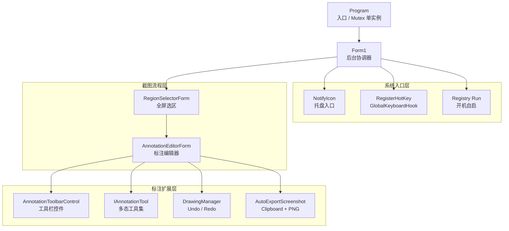
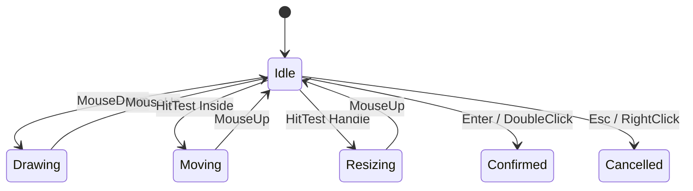

# <span class="gradient-text">PrintScreenApp</span>

<div class="hero-grid">
  <section class="hero-copy">
    <div class="eyebrow">C# DEFENSE · SCREEN CAPTURE ENGINE</div>
    <p class="hero-subtitle">
      基于 <strong>.NET 8</strong> / Windows Forms 的截图与标注工具
    </p>
    <div class="kbd-line">
      <kbd>Ctrl</kbd><span>+</span><kbd>Alt</kbd><span>+</span><kbd>Z</kbd>
      <em>Trigger Capture</em>
    </div>
    <div class="tech-stack">
      <span v-click>Win32 API</span>
      <span v-click>GDI+</span>
      <span v-click>Interface</span>
      <span v-click>Registry</span>
      <span v-click>Undo Stack</span>
    </div>
  </section>

  <section v-click class="capture-window">
    <div class="window-top">
      <i></i><i></i><i></i>
      <span>AnnotationEditorForm.cs</span>
    </div>
    <div class="capture-canvas">
      <div class="scan-line"></div>
      <div class="capture-rect">
        <b>1280 x 720</b>
        <i></i><i></i><i></i><i></i>
      </div>
      <div class="floating-toolbar">
        <span></span><span></span><span></span><span></span><span></span><span></span>
      </div>
    </div>
  </section>
</div>

<div class="abs-br pr-10 pb-7 text-sm opacity-60">
Windows Forms · Win32 Message · GDI+ Rendering · Tool Polymorphism
</div>

---
layout: center
---

# 展示目录

<div class="agenda-grid">
  <div v-click class="glass-card"><b>01</b><span>项目定位</span><p>为什么做截图工具，它解决什么真实使用问题</p></div>
  <div v-click class="glass-card"><b>02</b><span>运行链路</span><p>从热键触发到选区、标注、保存的完整流程</p></div>
  <div v-click class="glass-card"><b>03</b><span>C# 知识点</span><p>类、对象、接口、多态、事件、异常、资源释放</p></div>
  <div v-click class="glass-card"><b>04</b><span>核心代码</span><p>Win32 热键、GDI+ 截图、状态机、撤销重做</p></div>
  <div v-click class="glass-card"><b>05</b><span>创新演示</span><p>用视觉化方式展示选区、工具栏和调用链</p></div>
  <div v-click class="glass-card"><b>06</b><span>迭代计划</span><p>v2.0 WPF 重构，v3.0 人机交互截图</p></div>
</div>

---

# 项目定位：一个后台型效率工具

<div class="two-col">
  <div class="glass-card">
    <h2>用户看到的体验</h2>
    <div class="step-list">
      <div v-click><span>Hotkey</span>按快捷键或双击托盘图标开始截图</div>
      <div v-click><span>Region</span>拖拽选区，支持移动和 8 点缩放</div>
      <div v-click><span>Annotate</span>画笔、箭头、马赛克、高亮、橡皮擦</div>
      <div v-click><span>Export</span>保存后自动复制剪贴板并写入图片目录</div>
    </div>
  </div>

  <div class="glass-card">
    <h2>代码背后的能力</h2>
    <div class="matrix">
      <div v-click>WinForms 窗体生命周期</div>
      <div v-click>Win32 全局热键</div>
      <div v-click>GDI+ 图像绘制</div>
      <div v-click>JSON 配置持久化</div>
      <div v-click>Registry 开机自启</div>
      <div v-click>接口多态扩展工具</div>
    </div>
  </div>
</div>

---

# 近期功能更新

<div class="update-grid">
  <div v-click class="neon-card">
    <b>Auto Start</b>
    <p>使用 `Microsoft.Win32.Registry` 写入当前用户 Run 项，体现桌面应用和系统环境交互能力。</p>
  </div>
  <div v-click class="neon-card">
    <b>Tray First</b>
    <p>程序默认隐藏运行，双击托盘直接截图，更符合截图工具“随用随开”的产品习惯。</p>
  </div>
  <div v-click class="neon-card">
    <b>Embedded Toolbar</b>
    <p>`AnnotationToolbarControl` 改为嵌入式 `UserControl`，减少独立浮窗层级问题。</p>
  </div>
  <div v-click class="neon-card">
    <b>Tool Extension</b>
    <p>新增 `HighlighterTool` 和 `EraserTool`，用接口证明扩展能力，而不是硬编码堆功能。</p>
  </div>
</div>

---

# 系统架构图



---

# 函数调用链：从快捷键到 PNG

<div class="pipeline">
  <div v-click><b>Program.Main</b><span>Mutex 单实例，启动隐藏主窗体</span></div>
  <div v-click><b>Form1.InitializeHotKey</b><span>注册热键，安装键盘钩子</span></div>
  <div v-click><b>WndProc / KeyPressed</b><span>收到触发，进入截图流程</span></div>
  <div v-click><b>RegionSelectorForm</b><span>捕获全屏并返回选区 Bitmap</span></div>
  <div v-click><b>AnnotationEditorForm</b><span>把图片交给当前标注工具编辑</span></div>
  <div v-click><b>AutoExportScreenshot</b><span>复制剪贴板，保存 PNG 文件</span></div>
</div>

---

# 类、对象、接口的职责划分

| 类 / 对象 | 角色 | 核心职责 |
| --- | --- | --- |
| `Program` | 程序入口 | `Mutex` 单实例、窗口消息注册 |
| `Form1` | 后台协调器 | 托盘、热键、截图流程、开机自启 |
| `RegionSelectorForm` | 选区窗体 | 鼠标状态机、GDI+ 绘制遮罩 |
| `AnnotationEditorForm` | 标注编辑器 | 管理画布、工具栏、当前工具 |
| `AnnotationToolbarControl` | 工具栏控件 | 事件驱动，UI 与业务解耦 |
| `IAnnotationTool` | 工具接口 | 统一协议，多态调用 |
| `DrawingManager` | 历史管理器 | 栈结构保存撤销 / 重做历史 |

---

# Win32 热键：C# 调用系统能力

<div class="two-col">
<div class="code-panel">

```csharp {all|1-3|7|10-17|all}
[DllImport("user32.dll", SetLastError = true)]
private static extern bool RegisterHotKey(
    IntPtr hWnd, int id, uint fsModifiers, uint vk);

private void InitializeHotKey()
{
    DisposeHotKeys();
    const uint MOD_NOREPEAT = 0x4000;

    for (int i = 0; i < _hotKeyConfig.Entries.Count; i++)
    {
        HotKeyEntry entry = _hotKeyConfig.Entries[i];
        int id = 0xB000 + i;
        uint mod = (uint)entry.GetModifiers() | MOD_NOREPEAT;
        RegisterHotKey(Handle, id, mod, (uint)entry.Key);
    }
}
```

</div>
<div class="glass-card">
  <h2>知识点</h2>
  <div class="step-list compact">
    <div v-click><span>DllImport</span>C# 调用 user32.dll</div>
    <div v-click><span>Handle</span>把热键绑定到窗口句柄</div>
    <div v-click><span>List&lt;int&gt;</span>保存已注册热键 id</div>
    <div v-click><span>MOD_NOREPEAT</span>避免按住键盘连续触发</div>
  </div>
</div>
</div>

---

# 窗口消息：WinForms 的底层逻辑

<div class="code-panel wide">

```csharp {all|3-6|7-15|all}
protected override void WndProc(ref Message m)
{
    if (m.Msg == (int)Program.ShowAppMessageId)
    {
        BeginInvoke(new Action(StartRegionScreenshot));
    }
    else if (m.Msg == WM_HOTKEY)
    {
        int id = m.WParam.ToInt32();
        int idx = _registeredHotKeyIds.IndexOf(id);
        if (idx >= 0 && idx < _hotKeyConfig.Entries.Count)
        {
            BeginInvoke(new Action(StartRegionScreenshot));
            return;
        }
    }
    base.WndProc(ref m);
}
```

</div>

<div class="note-row">
  <div v-click><b>自定义消息</b><span>重复启动时通知已有实例</span></div>
  <div v-click><b>WM_HOTKEY</b><span>全局快捷键触发截图流程</span></div>
  <div v-click><b>BeginInvoke</b><span>回到 UI 消息队列执行</span></div>
</div>

---

# 低级键盘钩子：委托 + 事件

<div class="code-panel wide">

```csharp {all|1-4|8-13|15-20|all}
public sealed class GlobalKeyboardHook : IDisposable
{
    public Func<int, bool, bool, bool, bool, bool>? Matcher { get; set; }
    public event EventHandler<Keys>? KeyPressed;

    private IntPtr HookCallback(int nCode, IntPtr wParam, IntPtr lParam)
    {
        KeyboardHookStruct keyInfo =
            Marshal.PtrToStructure<KeyboardHookStruct>(lParam);

        bool matched = Matcher?.Invoke(vkCode, ctrlDown, altDown,
                                       shiftDown, winDown) ?? false;

        if (matched)
        {
            KeyPressed?.Invoke(this, (Keys)vkCode);
            return (IntPtr)1;
        }
        return CallNextHookEx(_hookId, nCode, wParam, lParam);
    }
}
```

</div>

---

# 开机自启：Registry Run 项

````md magic-move {lines: true}
```csharp
private const string StartupRegistryKey =
    @"Software\Microsoft\Windows\CurrentVersion\Run";
private const string StartupValueName = "PrintScreenApp";
```

```csharp
private static bool IsAutoStartEnabled()
{
    using RegistryKey? key =
        Registry.CurrentUser.OpenSubKey(StartupRegistryKey, false);

    string? value = key?.GetValue(StartupValueName) as string;
    return string.Equals(value, GetStartupCommand(),
                         StringComparison.OrdinalIgnoreCase);
}
```

```csharp
private void SetAutoStart(bool enabled)
{
    using RegistryKey key =
        Registry.CurrentUser.CreateSubKey(StartupRegistryKey);

    if (enabled)
        key.SetValue(StartupValueName, GetStartupCommand());
    else
        key.DeleteValue(StartupValueName, false);
}
```
````

---

# 选区交互：用状态机替代混乱布尔值



<div class="code-panel small-code">

```csharp {all|1-2|4-12|all}
private enum InteractionMode { Idle, Drawing, Moving, Resizing }
private enum HandleKind { None, TopLeft, Top, TopRight, Right, BottomRight, Bottom, BottomLeft, Left, Inside }

protected override void OnMouseMove(MouseEventArgs e)
{
    switch (_mode)
    {
        case InteractionMode.Drawing:  /* update rectangle */ break;
        case InteractionMode.Moving:   /* clamp position */ break;
        case InteractionMode.Resizing: /* resize by handle */ break;
    }
}
```

</div>

---

# GDI+ 截图与遮罩绘制

<div class="two-col">
<div class="code-panel">

```csharp {all|3-5|7-12|all}
private void CaptureFullScreen()
{
    Rectangle screenBounds = screen.Bounds;
    _fullScreenshot = new Bitmap(
        screenBounds.Width, screenBounds.Height);

    using (Graphics g = Graphics.FromImage(_fullScreenshot))
    {
        g.CopyFromScreen(screenBounds.Location,
                         Point.Empty,
                         screenBounds.Size);
    }
}
```

</div>
<div class="code-panel">

```csharp {all|3|4|6-10|all}
protected override void OnPaint(PaintEventArgs e)
{
    e.Graphics.DrawImage(_fullScreenshot, ClientRectangle);
    DrawMaskLayer(e);

    if (!_selectionRectangle.IsEmpty)
    {
        DrawHighlightedRegion(e);
        DrawSelectionBorder(e);
    }
}
```

</div>
</div>

<div class="note-row">
  <div v-click><b>Bitmap</b><span>图像对象，保存像素数据</span></div>
  <div v-click><b>Graphics</b><span>绘图上下文，负责复制和绘制</span></div>
  <div v-click><b>using</b><span>及时释放 GDI+ 资源</span></div>
</div>

---

# 接口：所有标注工具的协议

<div class="two-col">
<div class="code-panel">

```csharp {all|1|3-5|7-14|16-18|all}
public interface IAnnotationTool
{
    string Name { get; }
    Color ToolColor { get; set; }
    int ToolSize { get; set; }

    void OnMouseDown(MouseEventArgs e,
        Graphics graphics, Bitmap targetBitmap);
    void OnMouseMove(MouseEventArgs e,
        Graphics graphics, Bitmap targetBitmap);
    void OnMouseUp(MouseEventArgs e,
        Graphics graphics, Bitmap targetBitmap);

    void DrawPreview(Graphics graphics);
    void Commit(Graphics graphics, Bitmap targetBitmap);
    void Reset();
}
```

</div>
<div class="glass-card">
  <h2>接口机制</h2>
  <div class="step-list compact">
    <div v-click><span>抽象</span>定义工具应该会做什么</div>
    <div v-click><span>封装</span>每个工具内部保存自己的状态</div>
    <div v-click><span>多态</span>同一个方法调用，不同对象表现不同</div>
    <div v-click><span>扩展</span>新增工具只要实现接口即可接入</div>
  </div>
</div>
</div>

---

# 多态调用：编辑器不关心具体工具

````md magic-move {lines: true}
```csharp
private IAnnotationTool _currentTool = null!;
```

```csharp
private IAnnotationTool GetTool(AnnotationToolKind kind) => kind switch
{
    AnnotationToolKind.Pen => _penTool,
    AnnotationToolKind.Arrow => _arrowTool,
    AnnotationToolKind.Mosaic => _mosaicTool,
    AnnotationToolKind.Highlighter => _highlighterTool,
    AnnotationToolKind.Eraser => _eraserTool,
    _ => _penTool
};
```

```csharp
private void CanvasBox_MouseDown(object? sender, MouseEventArgs e)
{
    _drawingManager.SaveState(_editingImage);
    using Graphics g = Graphics.FromImage(_editingImage);
    _currentTool.OnMouseDown(e, g, _editingImage);
    _canvasBox.Invalidate();
}
```
````

---

# 创新点：高亮笔不是普通画线

<div class="two-col">
<div class="code-panel">

```csharp {all|3-4|6-12|14-21|all}
public class HighlighterTool : IAnnotationTool
{
    private readonly List<Point> _points = new();
    private bool _isDrawing;

    public void OnMouseMove(MouseEventArgs e,
        Graphics graphics, Bitmap targetBitmap)
    {
        if (_isDrawing)
            _points.Add(e.Location);
    }

    private void DrawStroke(Graphics graphics)
    {
        graphics.SmoothingMode = SmoothingMode.AntiAlias;
        graphics.CompositingMode = CompositingMode.SourceOver;
        using var pen = new Pen(Color.FromArgb(95, ToolColor),
                                Math.Max(8, ToolSize));
        graphics.DrawLines(pen, _points.ToArray());
    }
}
```

</div>
<div class="glass-card">
  <h2>实现机制</h2>
  <p>高亮笔保存鼠标轨迹点，用半透明颜色叠加到图片上，并开启抗锯齿。它不是简单“画一条线”，而是模拟真实标注工具的视觉效果。</p>
</div>
</div>

---

# 创新点：橡皮擦恢复原图像素

<div class="two-col">
<div class="code-panel">

```csharp {all|1|3|5-8|10-18|all}
public class EraserTool : IAnnotationTool, ISourceImageTool
{
    public Bitmap SourceImage { get; set; }

    public EraserTool(Bitmap sourceImage)
    {
        SourceImage = sourceImage;
    }

    private void RestoreStroke(Graphics graphics,
                               Bitmap targetBitmap)
    {
        using var path = new GraphicsPath();
        using var pen = new Pen(Color.Black, Math.Max(10, ToolSize));
        path.AddLines(_points.ToArray());
        path.Widen(pen);
        RestorePath(graphics, path, targetBitmap);
    }
}
```

</div>
<div class="glass-card">
  <h2>技术细节</h2>
  <div class="step-list compact">
    <div v-click><span>不是画白色</span>截图背景可能是任意颜色</div>
    <div v-click><span>恢复原图</span>从 `SourceImage` 取回原始像素</div>
    <div v-click><span>多接口</span>同时实现 `IAnnotationTool` 和 `ISourceImageTool`</div>
    <div v-click><span>GraphicsPath</span>用路径定义擦除区域</div>
  </div>
</div>
</div>

---

# 工具栏：事件驱动的视窗控件

<div class="two-col">
<div class="code-panel">

```csharp {all|1-7|9-14|all}
public event EventHandler<AnnotationToolKind>? ToolSelected;
public event EventHandler? ColorPickRequested;
public event EventHandler<int>? BrushSizeChanged;
public event EventHandler? UndoRequested;
public event EventHandler? RedoRequested;
public event EventHandler? SaveRequested;
public event EventHandler? CancelRequested;

btn.Click += (_, _) =>
{
    SetActiveButton(btn, kind);
    ToolSelected?.Invoke(this, kind);
};
```

</div>
<div class="glass-card">
  <h2>设计价值</h2>
  <p>`AnnotationToolbarControl` 只负责按钮、图标、拖动和事件派发；图片编辑逻辑仍在 `AnnotationEditorForm`。这让 UI 和业务逻辑解耦。</p>
</div>
</div>

---

# 撤销与重做：两个栈管理图片快照

<div class="two-col">
<div class="code-panel">

```csharp {all|1-2|4-9|11-18|all}
private Stack<Bitmap> _undoStack = new();
private Stack<Bitmap> _redoStack = new();

public void SaveState(Bitmap currentImage)
{
    _currentImage?.Dispose();
    _currentImage = (Bitmap)currentImage.Clone();
    SaveState();
}

public bool Undo()
{
    if (_undoStack.Count == 0) return false;
    _redoStack.Push(_currentImage);
    _currentImage = _undoStack.Pop();
    return true;
}
```

</div>
<div class="glass-card">
  <h2>知识点</h2>
  <div class="step-list compact">
    <div v-click><span>Stack</span>后进先出，适合撤销历史</div>
    <div v-click><span>Clone</span>避免多个历史状态引用同一张图</div>
    <div v-click><span>Dispose</span>释放旧图片资源</div>
    <div v-click><span>Invalidate</span>触发画布刷新</div>
  </div>
</div>
</div>

---

# 自动输出：剪贴板 + PNG

<div class="code-panel wide">

```csharp {all|6-12|14-24|26-31|all}
private void AutoExportScreenshot(Bitmap image)
{
    string? savedPath = null;
    string clipboardStatus;

    try
    {
        Clipboard.SetImage(image);
        clipboardStatus = "已复制到剪贴板";
        Log("Screenshot copied to clipboard.");
    }
    catch (Exception ex)
    {
        clipboardStatus = "复制剪贴板失败";
        Log($"Clipboard copy failed: {ex.Message}");
    }

    try
    {
        string folder = Path.Combine(
            Environment.GetFolderPath(Environment.SpecialFolder.MyPictures),
            "PrintScreenApp");
        Directory.CreateDirectory(folder);
        savedPath = Path.Combine(folder, $"Screenshot_{DateTime.Now:yyyyMMdd_HHmmss}.png");
        image.Save(savedPath, ImageFormat.Png);
    }
    catch (Exception ex)
    {
        Log($"Auto-save failed: {ex.Message}");
    }
}
```

</div>

---

# 现场演示流程

<div class="demo-grid">
  <div v-click><b>1</b><span>启动程序</span><p>后台隐藏、托盘入口、开机自启</p></div>
  <div v-click><b>2</b><span>触发截图</span><p>按 <kbd>Ctrl</kbd> + <kbd>Alt</kbd> + <kbd>Z</kbd></p></div>
  <div v-click><b>3</b><span>调整选区</span><p>展示拖拽、移动、8 个控制点缩放</p></div>
  <div v-click><b>4</b><span>标注编辑</span><p>切换画笔、箭头、高亮、橡皮擦</p></div>
  <div v-click><b>5</b><span>撤销重做</span><p>展示 DrawingManager 的两个历史栈</p></div>
  <div v-click><b>6</b><span>保存输出</span><p>展示剪贴板和 Pictures 目录</p></div>
</div>

---

# 产品迭代路线图

<div class="roadmap">
  <div v-click class="roadmap-item current">
    <span>v1.0</span>
    <b>WinForms 截图闭环</b>
    <p>热键触发、区域截图、标注编辑、撤销重做、剪贴板与本地保存。</p>
    <small>功能闭环 / C# 基础 / 桌面系统能力</small>
  </div>
  <div v-click class="roadmap-item">
    <span>v2.0</span>
    <b>WPF 现代化重构</b>
    <p>使用 XAML、数据绑定和 MVVM 思路重构界面，提升动画、布局和 DPI 适配。</p>
    <small>MVVM / Modern UI / Maintainability</small>
  </div>
  <div v-click class="roadmap-item future">
    <span>v3.0</span>
    <b>基础人机交互截图</b>
    <p>探索窗口悬停识别、控件边界吸附、快捷操作建议，让截图更智能。</p>
    <small>Interaction / Assistive Capture / Efficiency</small>
  </div>
</div>

---
layout: center
class: text-center
---

# <span class="gradient-text">Thank You</span>

### 欢迎老师和同学提问

<div class="mt-10 opacity-70">
PrintScreenApp · C# · .NET 8 · Windows Forms
</div>
