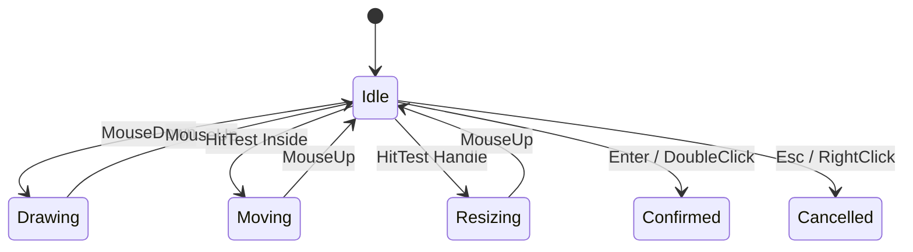
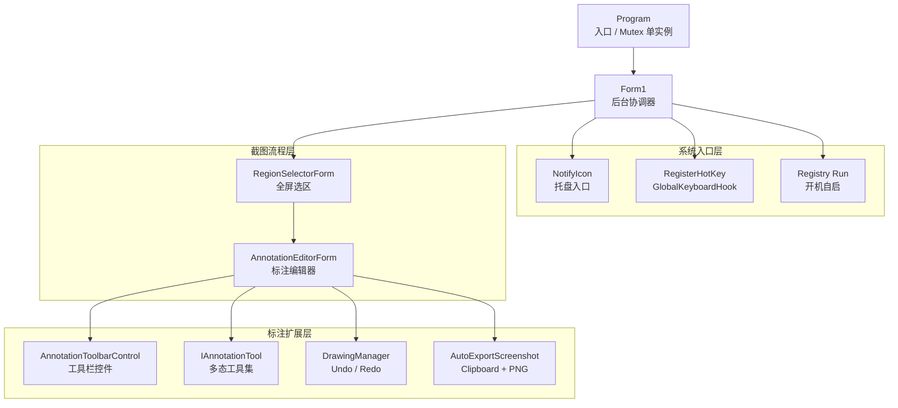

# <span class="gradient-text">PrintScreenApp</span>

<div class="hero-grid">
  <section class="hero-copy">
    <div class="eyebrow">C# DEFENSE · SCREEN CAPTURE ENGINE</div>
    <p class="hero-subtitle">
      基于 <strong>.NET 8</strong> / Windows Forms 的截图、选区、标注与导出工具
    </p>
    <div class="kbd-line">
      <kbd>Ctrl</kbd><span>+</span><kbd>Alt</kbd><span>+</span><kbd>Z</kbd>
      <em>Trigger Capture</em>
    </div>
    <div class="tech-stack">
      <span v-click>Win32 API</span>
      <span v-click>Message Loop</span>
      <span v-click>Mouse Events</span>
      <span v-click>GDI+</span>
      <span v-click>Interface</span>
      <span v-click>Undo Stack</span>
    </div>
  </section>

  <section v-click class="capture-window">
    <div class="window-top">
      <i></i><i></i><i></i>
      <span>RegionSelectorForm.cs</span>
    </div>
    <div class="capture-canvas">
      <div class="scan-line"></div>
      <div class="capture-rect">
        <b>1280 x 720</b>
        <i></i><i></i><i></i><i></i>
      </div>
      <div class="floating-toolbar">
        <span></span><span></span><span></span><span></span><span></span><span></span>
      </div>
    </div>
  </section>
</div>

<div class="abs-br pr-10 pb-7 text-sm opacity-60">
Demo First · Module Explain · Code Evidence
</div>

---
layout: center
---

# 功能模块目录

<div class="agenda-grid module-agenda">
  <div v-click class="glass-card"><b>01</b><span>主界面与主流程</span><p>程序启动、托盘常驻、单实例控制和截图流程调度。</p></div>
  <div v-click class="glass-card"><b>02</b><span>快捷键唤起</span><p>全局热键、Win32 消息循环和底层键盘钩子。</p></div>
  <div v-click class="glass-card"><b>03</b><span>截图遮罩与选区</span><p>屏幕捕获、双缓冲绘图、鼠标事件和复杂坐标计算。</p></div>
  <div v-click class="glass-card"><b>04</b><span>工具扩展机制</span><p>面向接口编程、标注工具多态、GDI+ 几何图形和滤镜绘制。</p></div>
  <div v-click class="glass-card"><b>05</b><span>撤销与重做</span><p>状态栈管理、快照保存，以及命令模式思想的应用。</p></div>
  <div v-click class="glass-card"><b>06</b><span>自动导出与启动</span><p>剪贴板、PNG 保存、托盘交互和开机自启。</p></div>
</div>

---

# 模块 01：主界面与主流程控制

<div class="two-col">
  <div class="glass-card">
    <h2>主流程职责</h2>
    <div class="step-list">
      <div v-click><span>Boot</span>应用启动后创建主窗体，但默认隐藏到后台。</div>
      <div v-click><span>Tray</span>通过托盘图标提供入口，不打断用户当前工作。</div>
      <div v-click><span>Mutex</span>单实例控制，避免重复启动造成多个热键监听。</div>
      <div v-click><span>Flow</span>统一调度“唤起 → 选区 → 编辑 → 导出”的完整链路。</div>
    </div>
  </div>

  <div class="glass-card">
    <h2>技术深度</h2>
    <div class="matrix">
      <div v-click>WinForms 生命周期</div>
      <div v-click>Application.Run 消息泵</div>
      <div v-click>NotifyIcon 桌面交互</div>
      <div v-click>窗体显示与隐藏控制</div>
      <div v-click>跨窗体传递 Bitmap</div>
      <div v-click>异常日志与用户反馈</div>
    </div>
  </div>
</div>

---

# 主流程控制：核心代码

<div class="two-col">
<div class="code-panel">

```csharp {all|1-3|5-8|10-12|all}
[STAThread]
static void Main()
{
    using var mutex = new Mutex(
        true, "PrintScreenApp.SingleInstance", out bool created);

    if (!created)
        return;

    ApplicationConfiguration.Initialize();
    Application.Run(new Form1());
}
```

</div>
<div class="code-panel">

```csharp {all|1-4|6-10|12-15|all}
private void StartRegionScreenshot()
{
    using var selector = new RegionSelectorForm();
    if (selector.ShowDialog() != DialogResult.OK)
        return;

    Bitmap selected = selector.SelectedBitmap;
    using var editor = new AnnotationEditorForm(selected);
    editor.ShowDialog();

    if (editor.ResultImage is not null)
        AutoExportScreenshot(editor.ResultImage);
}
```

</div>
</div>

---

# 模块 02：快捷键唤起演示

<div class="video-feature">
  <div class="video-shell">
    <video :src="'/videos/hotkey-demo.mp4'" autoplay loop muted playsinline controls></video>
  </div>
  <div class="glass-card video-notes">
    <h2>演示观察点</h2>
    <div class="step-list compact">
      <div v-click><span>后台常驻</span>主窗口隐藏运行，用户不用先打开界面。</div>
      <div v-click><span>全局触发</span>按下 <kbd>Ctrl</kbd> + <kbd>Alt</kbd> + <kbd>Z</kbd> 后立即进入截图。</div>
      <div v-click><span>消息驱动</span>热键消息回到 WinForms 窗口，再启动选区窗体。</div>
      <div v-click><span>体验目标</span>让截图动作接近系统级快捷操作。</div>
    </div>
  </div>
</div>

---

# 快捷键模块：Win32 API 与消息循环

<div class="two-col">
  <div class="glass-card">
    <h2>从操作到代码</h2>
    <div class="step-list">
      <div v-click><span>Register</span>调用 Win32 `RegisterHotKey` 注册系统级热键。</div>
      <div v-click><span>Handle</span>热键绑定到窗体句柄，系统把消息派发给该窗体。</div>
      <div v-click><span>WM_HOTKEY</span>重写 `WndProc`，在消息循环中捕获热键事件。</div>
      <div v-click><span>BeginInvoke</span>回到 UI 线程启动截图，避免线程上下文问题。</div>
    </div>
  </div>

  <div class="glass-card">
    <h2>答辩关键词</h2>
    <div class="matrix">
      <div v-click>P/Invoke</div>
      <div v-click>窗口句柄</div>
      <div v-click>消息泵</div>
      <div v-click>低级系统交互</div>
      <div v-click>UI 线程封送</div>
      <div v-click>资源注销</div>
    </div>
  </div>
</div>

---

# 快捷键模块：核心代码

<div class="two-col">
<div class="code-panel">

```csharp {all|1-3|7|10-17|all}
[DllImport("user32.dll", SetLastError = true)]
private static extern bool RegisterHotKey(
    IntPtr hWnd, int id, uint fsModifiers, uint vk);

private void InitializeHotKey()
{
    DisposeHotKeys();
    const uint MOD_NOREPEAT = 0x4000;

    for (int i = 0; i < _hotKeyConfig.Entries.Count; i++)
    {
        HotKeyEntry entry = _hotKeyConfig.Entries[i];
        int id = 0xB000 + i;
        uint mod = (uint)entry.GetModifiers() | MOD_NOREPEAT;
        RegisterHotKey(Handle, id, mod, (uint)entry.Key);
    }
}
```

</div>
<div class="code-panel">

```csharp {all|3-7|8-17|all}
protected override void WndProc(ref Message m)
{
    if (m.Msg == WM_HOTKEY)
    {
        int id = m.WParam.ToInt32();
        int idx = _registeredHotKeyIds.IndexOf(id);

        if (idx >= 0 && idx < _hotKeyConfig.Entries.Count)
        {
            BeginInvoke(new Action(StartRegionScreenshot));
            return;
        }
    }

    base.WndProc(ref m);
}
```

</div>
</div>

---

# 全局钩子：GlobalKeyboardHook

<div class="two-col">
<div class="code-panel">

```csharp {all|1-4|6-10|12-19|all}
public sealed class GlobalKeyboardHook : IDisposable
{
    public Func<int, bool, bool, bool, bool, bool>? Matcher { get; set; }
    public event EventHandler<Keys>? KeyPressed;

    private IntPtr HookCallback(int nCode, IntPtr wParam, IntPtr lParam)
    {
        KeyboardHookStruct keyInfo =
            Marshal.PtrToStructure<KeyboardHookStruct>(lParam);

        bool matched = Matcher?.Invoke(vkCode, ctrlDown, altDown,
                                       shiftDown, winDown) ?? false;

        if (matched)
        {
            KeyPressed?.Invoke(this, (Keys)vkCode);
            return (IntPtr)1;
        }
        return CallNextHookEx(_hookId, nCode, wParam, lParam);
    }
}
```

</div>
<div class="glass-card">
  <h2>为什么有技术含量</h2>
  <div class="step-list compact">
    <div v-click><span>Hook</span>底层键盘钩子比普通按钮事件更接近系统消息。</div>
    <div v-click><span>Marshal</span>把非托管内存结构转换成 C# 结构体。</div>
    <div v-click><span>Delegate</span>用委托把匹配规则交给外部配置。</div>
    <div v-click><span>Dispose</span>钩子必须及时卸载，否则会影响系统输入链路。</div>
  </div>
</div>
</div>

---

# 模块 03：截图核心调用

<div class="two-col">
<div class="code-panel">

```csharp {all|3-5|7-12|all}
private void CaptureFullScreen()
{
    Rectangle screenBounds = screen.Bounds;
    _fullScreenshot = new Bitmap(
        screenBounds.Width, screenBounds.Height);

    using (Graphics g = Graphics.FromImage(_fullScreenshot))
    {
        g.CopyFromScreen(screenBounds.Location,
                         Point.Empty,
                         screenBounds.Size);
    }
}
```

</div>
<div class="glass-card">
  <h2>知识点</h2>
  <div class="step-list compact">
    <div v-click><span>Bitmap</span>在内存中保存屏幕像素数据。</div>
    <div v-click><span>Graphics</span>GDI+ 绘图上下文，负责复制屏幕图像。</div>
    <div v-click><span>Bounds</span>适配不同屏幕尺寸和多显示器坐标。</div>
    <div v-click><span>using</span>及时释放 GDI+ 资源，避免句柄泄漏。</div>
  </div>
</div>
</div>

---

# 遮罩选区：MouseDown / Move / Up

<div class="two-col">
<div class="code-panel">

```csharp {all|1-4|6-12|14-20|all}
protected override void OnMouseDown(MouseEventArgs e)
{
    _startPoint = e.Location;
    _mode = HitTest(e.Location) == HandleKind.None
        ? InteractionMode.Drawing
        : InteractionMode.Resizing;
}

protected override void OnMouseMove(MouseEventArgs e)
{
    switch (_mode)
    {
        case InteractionMode.Drawing:
            UpdateDrawingRectangle(e.Location); break;
        case InteractionMode.Moving:
            MoveSelection(e.Location); break;
        case InteractionMode.Resizing:
            ResizeSelection(e.Location); break;
    }
    Invalidate();
}
```

</div>
<div class="glass-card">
  <h2>交互状态</h2>
  <div class="step-list compact">
    <div v-click><span>Down</span>记录起点，并判断是新建、移动还是缩放。</div>
    <div v-click><span>Move</span>根据当前模式持续更新选区矩形。</div>
    <div v-click><span>Up</span>确认当前状态，把模式恢复到 Idle。</div>
    <div v-click><span>Invalidate</span>让 WinForms 重新绘制遮罩和边框。</div>
  </div>
</div>
</div>

---

# 遮罩选区：双缓冲绘图

<div class="two-col">
<div class="code-panel">

```csharp {all|3-5|7-12|all}
public RegionSelectorForm()
{
    SetStyle(ControlStyles.AllPaintingInWmPaint |
             ControlStyles.UserPaint |
             ControlStyles.OptimizedDoubleBuffer, true);
    UpdateStyles();
}

protected override void OnPaint(PaintEventArgs e)
{
    e.Graphics.DrawImage(_fullScreenshot, ClientRectangle);
    DrawMaskLayer(e);
    DrawSelectionBorder(e);
}
```

</div>
<div class="glass-card">
  <h2>为什么防闪烁</h2>
  <div class="step-list compact">
    <div v-click><span>问题</span>鼠标移动时遮罩层频繁重绘，容易出现闪烁。</div>
    <div v-click><span>Buffer</span>先在内存缓冲区完成绘制，再一次性呈现到屏幕。</div>
    <div v-click><span>Paint</span>所有绘制集中在 `OnPaint`，避免多处直接画屏幕。</div>
    <div v-click><span>体验</span>选区拖动更顺滑，边框和蒙层不会跳动。</div>
  </div>
</div>
</div>

---

# 遮罩选区：复杂坐标计算

<div class="two-col">
<div class="code-panel">

```csharp {all|1-4|6-13|15-21|all}
private Rectangle NormalizeRectangle(Point a, Point b)
{
    int left = Math.Min(a.X, b.X);
    int top = Math.Min(a.Y, b.Y);
    int right = Math.Max(a.X, b.X);
    int bottom = Math.Max(a.Y, b.Y);

    return Rectangle.FromLTRB(left, top, right, bottom);
}

private Rectangle ClampToScreen(Rectangle rect)
{
    rect.X = Math.Max(0, rect.X);
    rect.Y = Math.Max(0, rect.Y);
    rect.Width = Math.Min(rect.Width, Width - rect.X);
    rect.Height = Math.Min(rect.Height, Height - rect.Y);
    return rect;
}
```

</div>
<div class="glass-card">
  <h2>坐标难点</h2>
  <div class="step-list compact">
    <div v-click><span>方向</span>用户可以从任意方向拖拽，矩形必须标准化。</div>
    <div v-click><span>边界</span>移动和缩放不能让选区跑出屏幕。</div>
    <div v-click><span>Handles</span>8 个控制点分别影响不同边或角。</div>
    <div v-click><span>Scale</span>显示坐标、屏幕坐标和 Bitmap 坐标需要统一。</div>
  </div>
</div>
</div>

---

# 遮罩选区：状态机设计



<div class="note-row">
  <div v-click><b>Idle</b><span>等待用户开始选择，负责命中检测。</span></div>
  <div v-click><b>Drawing</b><span>根据鼠标起点和当前位置生成矩形。</span></div>
  <div v-click><b>Moving / Resizing</b><span>复用同一个选区，支持调整而不是重新截图。</span></div>
</div>

---

# 模块 04：工具扩展演示

<div class="video-feature">
  <div class="video-shell">
    <video :src="'/videos/mask-demo.mp4'" autoplay loop muted playsinline controls></video>
  </div>
  <div class="glass-card video-notes">
    <h2>演示观察点</h2>
    <div class="step-list compact">
      <div v-click><span>Toolbar</span>工具栏切换当前标注工具。</div>
      <div v-click><span>Preview</span>拖动过程中显示预览，松开后提交到 Bitmap。</div>
      <div v-click><span>Shape</span>不同工具对应不同 GDI+ 几何绘制方式。</div>
      <div v-click><span>Filter</span>马赛克、高亮、橡皮擦体现图像处理能力。</div>
    </div>
  </div>
</div>

---

# 工具扩展：面向接口编程

<div class="two-col">
<div class="code-panel">

```csharp {all|1|3-5|7-14|16-18|all}
public interface IAnnotationTool
{
    string Name { get; }
    Color ToolColor { get; set; }
    int ToolSize { get; set; }

    void OnMouseDown(MouseEventArgs e,
        Graphics graphics, Bitmap targetBitmap);
    void OnMouseMove(MouseEventArgs e,
        Graphics graphics, Bitmap targetBitmap);
    void OnMouseUp(MouseEventArgs e,
        Graphics graphics, Bitmap targetBitmap);

    void DrawPreview(Graphics graphics);
    void Commit(Graphics graphics, Bitmap targetBitmap);
    void Reset();
}
```

</div>
<div class="glass-card">
  <h2>经典设计思想</h2>
  <div class="step-list compact">
    <div v-click><span>Strategy</span>每个工具是一种绘制策略，运行时可切换。</div>
    <div v-click><span>Polymorphism</span>编辑器调用统一接口，不依赖具体类。</div>
    <div v-click><span>Open</span>新增工具时扩展类，而不是修改编辑器主逻辑。</div>
    <div v-click><span>State</span>工具内部保存自己的鼠标轨迹和绘制状态。</div>
  </div>
</div>
</div>

---

# 工具扩展：GDI+ 几何图形绘制

<div class="two-col">
<div class="code-panel">

```csharp {all|1-5|7-12|14-17|all}
private void DrawArrow(Graphics g, Point start, Point end)
{
    g.SmoothingMode = SmoothingMode.AntiAlias;
    using var pen = new Pen(ToolColor, ToolSize)
    {
        StartCap = LineCap.Round,
        EndCap = LineCap.Custom
    };

    var cap = new AdjustableArrowCap(5, 6);
    pen.CustomEndCap = cap;
    g.DrawLine(pen, start, end);
}
```

</div>
<div class="code-panel">

```csharp {all|1-4|6-12|14-19|all}
private void DrawRectangle(Graphics g, Rectangle rect)
{
    g.SmoothingMode = SmoothingMode.AntiAlias;
    using var pen = new Pen(ToolColor, ToolSize);

    if (FillShape)
    {
        using var brush = new SolidBrush(
            Color.FromArgb(60, ToolColor));
        g.FillRectangle(brush, rect);
    }

    g.DrawRectangle(pen, rect);
}
```

</div>
</div>

---

# 工具扩展：马赛克滤镜

<div class="two-col">
<div class="code-panel">

```csharp {all|1-4|6-13|15-22|all}
private void ApplyMosaic(Bitmap bitmap, Rectangle area)
{
    const int blockSize = 10;

    for (int y = area.Top; y < area.Bottom; y += blockSize)
    for (int x = area.Left; x < area.Right; x += blockSize)
    {
        Rectangle block = new Rectangle(
            x, y,
            Math.Min(blockSize, area.Right - x),
            Math.Min(blockSize, area.Bottom - y));

        Color avg = GetAverageColor(bitmap, block);
        using Graphics g = Graphics.FromImage(bitmap);
        using var brush = new SolidBrush(avg);
        g.FillRectangle(brush, block);
    }
}
```

</div>
<div class="glass-card">
  <h2>滤镜原理</h2>
  <div class="step-list compact">
    <div v-click><span>Block</span>把选中区域切成固定大小的小块。</div>
    <div v-click><span>Average</span>计算每个块的平均颜色。</div>
    <div v-click><span>Fill</span>用平均色填充整块，降低细节可识别度。</div>
    <div v-click><span>Tradeoff</span>块越大隐私越强，视觉细节越少。</div>
  </div>
</div>
</div>

---

# 工具扩展：高亮笔与橡皮擦

<div class="two-col">
<div class="code-panel">

```csharp {all|3-4|6-12|14-21|all}
public class HighlighterTool : IAnnotationTool
{
    private readonly List<Point> _points = new();
    private bool _isDrawing;

    public void OnMouseMove(MouseEventArgs e,
        Graphics graphics, Bitmap targetBitmap)
    {
        if (_isDrawing)
            _points.Add(e.Location);
    }

    private void DrawStroke(Graphics graphics)
    {
        graphics.SmoothingMode = SmoothingMode.AntiAlias;
        graphics.CompositingMode = CompositingMode.SourceOver;
        using var pen = new Pen(Color.FromArgb(95, ToolColor),
                                Math.Max(8, ToolSize));
        graphics.DrawLines(pen, _points.ToArray());
    }
}
```

</div>
<div class="code-panel">

```csharp {all|1|3|5-8|10-18|all}
public class EraserTool : IAnnotationTool, ISourceImageTool
{
    public Bitmap SourceImage { get; set; }

    public EraserTool(Bitmap sourceImage)
    {
        SourceImage = sourceImage;
    }

    private void RestoreStroke(Graphics graphics,
                               Bitmap targetBitmap)
    {
        using var path = new GraphicsPath();
        using var pen = new Pen(Color.Black, Math.Max(10, ToolSize));
        path.AddLines(_points.ToArray());
        path.Widen(pen);
        RestorePath(graphics, path, targetBitmap);
    }
}
```

</div>
</div>

---

# 模块 05：撤销与重做演示

<div class="video-feature">
  <div class="video-shell">
    <video :src="'/videos/undo-redo-demo.mp4'" autoplay loop muted playsinline controls></video>
  </div>
  <div class="glass-card video-notes">
    <h2>演示观察点</h2>
    <div class="step-list compact">
      <div v-click><span>Before</span>每次绘制前保存当前图片快照。</div>
      <div v-click><span>Undo</span>从撤销栈取出上一张图，恢复画布状态。</div>
      <div v-click><span>Redo</span>撤销时保存当前图，让操作可以重新应用。</div>
      <div v-click><span>Memory</span>Bitmap 是非托管资源，历史管理必须考虑释放。</div>
    </div>
  </div>
</div>

---

# 撤销重做：状态栈与命令模式思想

<div class="two-col">
<div class="code-panel">

```csharp {all|1-2|4-9|11-18|all}
private Stack<Bitmap> _undoStack = new();
private Stack<Bitmap> _redoStack = new();

public void SaveState(Bitmap currentImage)
{
    _currentImage?.Dispose();
    _currentImage = (Bitmap)currentImage.Clone();
    _undoStack.Push((Bitmap)_currentImage.Clone());
    _redoStack.Clear();
}

public bool Undo()
{
    if (_undoStack.Count == 0) return false;
    _redoStack.Push((Bitmap)_currentImage.Clone());
    _currentImage = _undoStack.Pop();
    return true;
}
```

</div>
<div class="glass-card">
  <h2>设计模式解释</h2>
  <div class="step-list compact">
    <div v-click><span>State</span>当前图片是一种可恢复状态。</div>
    <div v-click><span>Snapshot</span>保存 Bitmap 快照，相当于保存每一步结果。</div>
    <div v-click><span>Command</span>从思想上看，撤销和重做是对用户操作的反向/重新执行。</div>
    <div v-click><span>Tradeoff</span>快照实现简单稳定，但内存成本高于记录命令。</div>
  </div>
</div>
</div>

---

# 撤销重做：资源与边界处理

<div class="two-col">
<div class="code-panel">

```csharp {all|1-7|9-16|all}
private void TrimHistory()
{
    while (_undoStack.Count > MaxHistoryCount)
    {
        Bitmap old = RemoveBottom(_undoStack);
        old.Dispose();
    }
}

public void Clear()
{
    foreach (Bitmap bitmap in _undoStack)
        bitmap.Dispose();
    foreach (Bitmap bitmap in _redoStack)
        bitmap.Dispose();
    _undoStack.Clear();
    _redoStack.Clear();
}
```

</div>
<div class="glass-card">
  <h2>答辩补充</h2>
  <div class="step-list compact">
    <div v-click><span>Limit</span>历史数量需要上限，避免连续绘制占用过多内存。</div>
    <div v-click><span>Clear</span>新操作发生后重做栈应清空，符合用户预期。</div>
    <div v-click><span>Dispose</span>Bitmap 背后持有 GDI+ 资源，不能只等 GC。</div>
    <div v-click><span>UX</span>按钮状态可根据栈数量启用或禁用。</div>
  </div>
</div>
</div>

---

# 模块 06：自动导出与启动

<div class="two-col">
<div class="code-panel">

```csharp {all|6-12|14-24|26-31|all}
private void AutoExportScreenshot(Bitmap image)
{
    string? savedPath = null;
    string clipboardStatus;

    try
    {
        Clipboard.SetImage(image);
        clipboardStatus = "已复制到剪贴板";
        Log("Screenshot copied to clipboard.");
    }
    catch (Exception ex)
    {
        clipboardStatus = "复制剪贴板失败";
        Log($"Clipboard copy failed: {ex.Message}");
    }

    try
    {
        string folder = Path.Combine(
            Environment.GetFolderPath(Environment.SpecialFolder.MyPictures),
            "PrintScreenApp");
        Directory.CreateDirectory(folder);
        savedPath = Path.Combine(folder, $"Screenshot_{DateTime.Now:yyyyMMdd_HHmmss}.png");
        image.Save(savedPath, ImageFormat.Png);
    }
    catch (Exception ex)
    {
        Log($"Auto-save failed: {ex.Message}");
    }
}
```

</div>
<div class="glass-card">
  <h2>模块价值</h2>
  <div class="step-list compact">
    <div v-click><span>Clipboard</span>截图后直接进入剪贴板，方便粘贴到聊天或文档。</div>
    <div v-click><span>PNG</span>同时落盘保存，形成可追溯的本地文件。</div>
    <div v-click><span>Tray</span>托盘常驻让工具始终处于可唤起状态。</div>
    <div v-click><span>Registry</span>写入当前用户 Run 项，实现开机自启。</div>
  </div>
</div>
</div>

---

# 系统架构图



---

# 总结：从演示到代码的闭环

<div class="roadmap">
  <div v-click class="roadmap-item current">
    <span>01</span>
    <b>用户动作可见</b>
    <p>先展示快捷键、工具扩展、撤销重做，让老师看到真实功能。</p>
    <small>Demo / Interaction / Feedback</small>
  </div>
  <div v-click class="roadmap-item">
    <span>02</span>
    <b>技术链路清晰</b>
    <p>从 Win32 消息、鼠标事件、GDI+ 绘图到接口多态逐层展开。</p>
    <small>Win32 / Mouse / GDI+ / Interface</small>
  </div>
  <div v-click class="roadmap-item future">
    <span>03</span>
    <b>设计思想支撑</b>
    <p>用策略模式、面向接口、状态栈和命令模式思想解释代码结构。</p>
    <small>Strategy / State / Command</small>
  </div>
</div>

---
layout: center
class: text-center
---

# <span class="gradient-text">Thank You</span>

### 欢迎老师和同学提问

<div class="mt-10 opacity-70">
PrintScreenApp · C# · .NET 8 · Windows Forms
</div>
