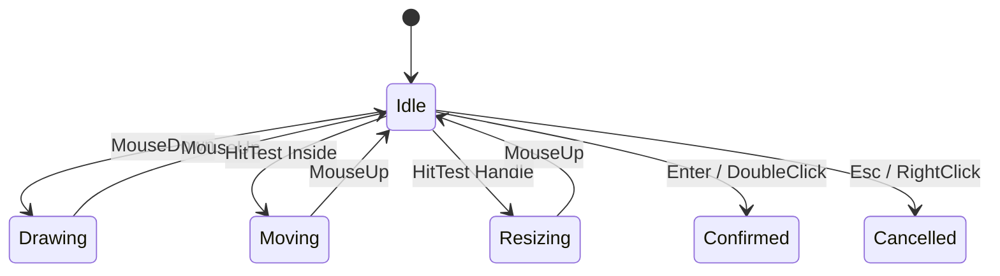
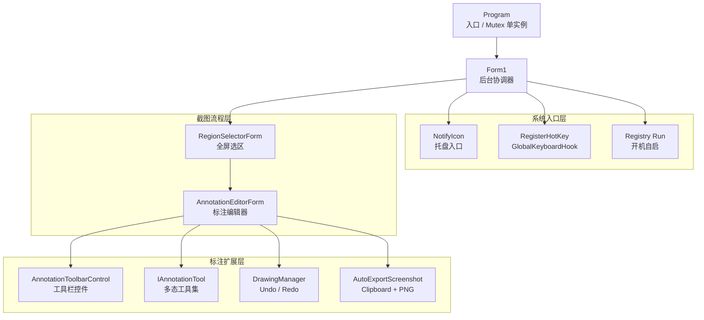

# <span class="gradient-text">PrintScreenApp</span>

<div class="hero-grid">
  <section class="hero-copy">
    <div class="eyebrow">C# DEFENSE · SCREEN CAPTURE ENGINE</div>
    <p class="hero-subtitle">
      基于 <strong>.NET 8</strong> / Windows Forms 的截图与标注工具
    </p>
    <div class="kbd-line">
      <kbd>Ctrl</kbd><span>+</span><kbd>Alt</kbd><span>+</span><kbd>Z</kbd>
      <em>Trigger Capture</em>
    </div>
    <div class="tech-stack">
      <span v-click>Win32 API</span>
      <span v-click>GDI+</span>
      <span v-click>Message Loop</span>
      <span v-click>Interface</span>
      <span v-click>Undo Stack</span>
    </div>
  </section>

  <section v-click class="capture-window">
    <div class="window-top">
      <i></i><i></i><i></i>
      <span>RegionSelectorForm.cs</span>
    </div>
    <div class="capture-canvas">
      <div class="scan-line"></div>
      <div class="capture-rect">
        <b>1280 x 720</b>
        <i></i><i></i><i></i><i></i>
      </div>
      <div class="floating-toolbar">
        <span></span><span></span><span></span><span></span><span></span><span></span>
      </div>
    </div>
  </section>
</div>

<div class="abs-br pr-10 pb-7 text-sm opacity-60">
Demo First · Module Explain · Code Evidence
</div>

---
layout: center
---

# 功能模块目录

<div class="agenda-grid module-agenda">
  <div v-click class="glass-card"><b>01</b><span>快捷键唤起</span><p>从循环演示开始，说明全局热键如何让后台程序进入截图流程。</p></div>
  <div v-click class="glass-card"><b>02</b><span>屏幕遮罩与选区</span><p>展示全屏遮罩、鼠标拖拽、选区高亮和尺寸反馈。</p></div>
  <div v-click class="glass-card"><b>03</b><span>标注编辑器</span><p>把截图交给编辑窗口，完成画笔、箭头、高亮等操作。</p></div>
  <div v-click class="glass-card"><b>04</b><span>工具扩展机制</span><p>用接口和多态组织标注工具，降低新增功能成本。</p></div>
  <div v-click class="glass-card"><b>05</b><span>撤销与重做</span><p>用图片快照栈管理编辑历史，让误操作可以回退。</p></div>
  <div v-click class="glass-card"><b>06</b><span>自动导出与启动</span><p>保存 PNG、复制剪贴板，并支持托盘常驻和开机自启。</p></div>
</div>

---

# 模块 01：快捷键唤起演示

<div class="video-feature">
  <div class="video-shell">
    <video :src="'/videos/hotkey-demo.mp4'" autoplay loop muted playsinline controls></video>
  </div>
  <div class="glass-card video-notes">
    <h2>演示观察点</h2>
    <div class="step-list compact">
      <div v-click><span>后台常驻</span>主窗口隐藏运行，用户不用先打开界面。</div>
      <div v-click><span>全局触发</span>按下 <kbd>Ctrl</kbd> + <kbd>Alt</kbd> + <kbd>Z</kbd> 后立即进入截图。</div>
      <div v-click><span>消息驱动</span>热键消息回到 WinForms 窗口，再启动选区窗体。</div>
      <div v-click><span>体验目标</span>让截图动作接近系统级快捷操作，减少准备步骤。</div>
    </div>
  </div>
</div>

---

# 快捷键模块：知识点拆解

<div class="two-col">
  <div class="glass-card">
    <h2>从操作到代码</h2>
    <div class="step-list">
      <div v-click><span>Register</span>调用 Win32 `RegisterHotKey` 注册全局快捷键。</div>
      <div v-click><span>Handle</span>把热键绑定到窗体句柄，让系统消息可以送达程序。</div>
      <div v-click><span>WndProc</span>重写窗口消息处理函数，捕获 `WM_HOTKEY`。</div>
      <div v-click><span>Invoke</span>回到 UI 线程启动截图流程，避免线程上下文错误。</div>
    </div>
  </div>

  <div class="glass-card">
    <h2>C# 知识点</h2>
    <div class="matrix">
      <div v-click>P/Invoke 调用系统 API</div>
      <div v-click>窗口句柄与消息循环</div>
      <div v-click>集合保存热键 ID</div>
      <div v-click>异常兜底与资源释放</div>
      <div v-click>委托封送 UI 操作</div>
      <div v-click>后台程序交互设计</div>
    </div>
  </div>
</div>

---

# 快捷键模块：核心代码

<div class="two-col">
<div class="code-panel">

```csharp {all|1-3|7|10-17|all}
[DllImport("user32.dll", SetLastError = true)]
private static extern bool RegisterHotKey(
    IntPtr hWnd, int id, uint fsModifiers, uint vk);

private void InitializeHotKey()
{
    DisposeHotKeys();
    const uint MOD_NOREPEAT = 0x4000;

    for (int i = 0; i < _hotKeyConfig.Entries.Count; i++)
    {
        HotKeyEntry entry = _hotKeyConfig.Entries[i];
        int id = 0xB000 + i;
        uint mod = (uint)entry.GetModifiers() | MOD_NOREPEAT;
        RegisterHotKey(Handle, id, mod, (uint)entry.Key);
    }
}
```

</div>
<div class="code-panel">

```csharp {all|3-7|8-17|all}
protected override void WndProc(ref Message m)
{
    if (m.Msg == WM_HOTKEY)
    {
        int id = m.WParam.ToInt32();
        int idx = _registeredHotKeyIds.IndexOf(id);

        if (idx >= 0 && idx < _hotKeyConfig.Entries.Count)
        {
            BeginInvoke(new Action(StartRegionScreenshot));
            return;
        }
    }

    base.WndProc(ref m);
}
```

</div>
</div>

---

# 模块 02：屏幕遮罩演示

<div class="video-feature">
  <div class="video-shell">
    <video :src="'/videos/mask-demo.mp4'" autoplay loop muted playsinline controls></video>
  </div>
  <div class="glass-card video-notes">
    <h2>演示观察点</h2>
    <div class="step-list compact">
      <div v-click><span>全屏捕获</span>先把当前屏幕保存成一张 Bitmap，作为选区背景。</div>
      <div v-click><span>遮罩层</span>用半透明蒙层弱化未选区域，突出用户正在选择的区域。</div>
      <div v-click><span>交互状态</span>鼠标按下、移动、松开分别对应不同状态变化。</div>
      <div v-click><span>边界控制</span>选区移动和缩放都需要限制在屏幕范围内。</div>
    </div>
  </div>
</div>

---

# 遮罩选区模块：状态机设计



<div class="note-row">
  <div v-click><b>Idle</b><span>等待用户开始选择，负责命中检测。</span></div>
  <div v-click><b>Drawing</b><span>根据鼠标起点和当前位置生成矩形。</span></div>
  <div v-click><b>Moving / Resizing</b><span>复用同一个选区，支持调整而不是重新截图。</span></div>
</div>

---

# 遮罩选区模块：核心代码

<div class="two-col">
<div class="code-panel">

```csharp {all|3-5|7-12|all}
private void CaptureFullScreen()
{
    Rectangle screenBounds = screen.Bounds;
    _fullScreenshot = new Bitmap(
        screenBounds.Width, screenBounds.Height);

    using (Graphics g = Graphics.FromImage(_fullScreenshot))
    {
        g.CopyFromScreen(screenBounds.Location,
                         Point.Empty,
                         screenBounds.Size);
    }
}
```

</div>
<div class="code-panel">

```csharp {all|3|4|6-10|all}
protected override void OnPaint(PaintEventArgs e)
{
    e.Graphics.DrawImage(_fullScreenshot, ClientRectangle);
    DrawMaskLayer(e);

    if (!_selectionRectangle.IsEmpty)
    {
        DrawHighlightedRegion(e);
        DrawSelectionBorder(e);
    }
}
```

</div>
</div>

---

# 模块 03：标注编辑器

<div class="two-col">
  <div class="glass-card">
    <h2>模块职责</h2>
    <div class="step-list">
      <div v-click><span>Receive</span>接收选区 Bitmap，进入独立编辑窗口。</div>
      <div v-click><span>Canvas</span>维护正在编辑的图像和画布刷新。</div>
      <div v-click><span>Toolbar</span>监听工具栏事件，切换当前工具和颜色尺寸。</div>
      <div v-click><span>Commit</span>把每次绘制提交到目标图片，并触发重绘。</div>
    </div>
  </div>

  <div class="code-panel">

```csharp {all|1|3-8|10-13|all}
private IAnnotationTool _currentTool = null!;

private void CanvasBox_MouseDown(object? sender, MouseEventArgs e)
{
    _drawingManager.SaveState(_editingImage);
    using Graphics g = Graphics.FromImage(_editingImage);
    _currentTool.OnMouseDown(e, g, _editingImage);
    _canvasBox.Invalidate();
}

private void SetCurrentTool(AnnotationToolKind kind)
{
    _currentTool = GetTool(kind);
}
```

  </div>
</div>

---

# 模块 04：工具扩展机制

<div class="two-col">
<div class="code-panel">

```csharp {all|1|3-5|7-14|16-18|all}
public interface IAnnotationTool
{
    string Name { get; }
    Color ToolColor { get; set; }
    int ToolSize { get; set; }

    void OnMouseDown(MouseEventArgs e,
        Graphics graphics, Bitmap targetBitmap);
    void OnMouseMove(MouseEventArgs e,
        Graphics graphics, Bitmap targetBitmap);
    void OnMouseUp(MouseEventArgs e,
        Graphics graphics, Bitmap targetBitmap);

    void DrawPreview(Graphics graphics);
    void Commit(Graphics graphics, Bitmap targetBitmap);
    void Reset();
}
```

</div>
<div class="glass-card">
  <h2>为什么要用接口</h2>
  <div class="step-list compact">
    <div v-click><span>抽象</span>编辑器只关心工具协议，不关心具体实现。</div>
    <div v-click><span>封装</span>每个工具内部保存自己的鼠标轨迹和绘制状态。</div>
    <div v-click><span>多态</span>同一个方法调用，不同工具呈现不同绘制效果。</div>
    <div v-click><span>扩展</span>新增工具只需要实现接口并加入工具选择逻辑。</div>
  </div>
</div>
</div>

---

# 工具扩展：高亮笔与橡皮擦

<div class="two-col">
<div class="code-panel">

```csharp {all|3-4|6-12|14-21|all}
public class HighlighterTool : IAnnotationTool
{
    private readonly List<Point> _points = new();
    private bool _isDrawing;

    public void OnMouseMove(MouseEventArgs e,
        Graphics graphics, Bitmap targetBitmap)
    {
        if (_isDrawing)
            _points.Add(e.Location);
    }

    private void DrawStroke(Graphics graphics)
    {
        graphics.SmoothingMode = SmoothingMode.AntiAlias;
        graphics.CompositingMode = CompositingMode.SourceOver;
        using var pen = new Pen(Color.FromArgb(95, ToolColor),
                                Math.Max(8, ToolSize));
        graphics.DrawLines(pen, _points.ToArray());
    }
}
```

</div>
<div class="code-panel">

```csharp {all|1|3|5-8|10-18|all}
public class EraserTool : IAnnotationTool, ISourceImageTool
{
    public Bitmap SourceImage { get; set; }

    public EraserTool(Bitmap sourceImage)
    {
        SourceImage = sourceImage;
    }

    private void RestoreStroke(Graphics graphics,
                               Bitmap targetBitmap)
    {
        using var path = new GraphicsPath();
        using var pen = new Pen(Color.Black, Math.Max(10, ToolSize));
        path.AddLines(_points.ToArray());
        path.Widen(pen);
        RestorePath(graphics, path, targetBitmap);
    }
}
```

</div>
</div>

---

# 模块 05：撤销与重做

<div class="two-col">
<div class="code-panel">

```csharp {all|1-2|4-9|11-18|all}
private Stack<Bitmap> _undoStack = new();
private Stack<Bitmap> _redoStack = new();

public void SaveState(Bitmap currentImage)
{
    _currentImage?.Dispose();
    _currentImage = (Bitmap)currentImage.Clone();
    SaveState();
}

public bool Undo()
{
    if (_undoStack.Count == 0) return false;
    _redoStack.Push(_currentImage);
    _currentImage = _undoStack.Pop();
    return true;
}
```

</div>
<div class="glass-card">
  <h2>知识点</h2>
  <div class="step-list compact">
    <div v-click><span>Stack</span>后进先出，适合保存编辑历史。</div>
    <div v-click><span>Clone</span>每次保存独立图片快照，避免引用同一张图。</div>
    <div v-click><span>Dispose</span>旧 Bitmap 要及时释放，减少内存压力。</div>
    <div v-click><span>Redo</span>撤销时把当前图压入重做栈，形成双栈结构。</div>
  </div>
</div>
</div>

---

# 模块 06：自动导出与启动

<div class="two-col">
<div class="code-panel">

```csharp {all|6-12|14-24|26-31|all}
private void AutoExportScreenshot(Bitmap image)
{
    string? savedPath = null;
    string clipboardStatus;

    try
    {
        Clipboard.SetImage(image);
        clipboardStatus = "已复制到剪贴板";
        Log("Screenshot copied to clipboard.");
    }
    catch (Exception ex)
    {
        clipboardStatus = "复制剪贴板失败";
        Log($"Clipboard copy failed: {ex.Message}");
    }

    try
    {
        string folder = Path.Combine(
            Environment.GetFolderPath(Environment.SpecialFolder.MyPictures),
            "PrintScreenApp");
        Directory.CreateDirectory(folder);
        savedPath = Path.Combine(folder, $"Screenshot_{DateTime.Now:yyyyMMdd_HHmmss}.png");
        image.Save(savedPath, ImageFormat.Png);
    }
    catch (Exception ex)
    {
        Log($"Auto-save failed: {ex.Message}");
    }
}
```

</div>
<div class="glass-card">
  <h2>模块价值</h2>
  <div class="step-list compact">
    <div v-click><span>Clipboard</span>截图后直接进入剪贴板，方便粘贴到聊天或文档。</div>
    <div v-click><span>PNG</span>同时落盘保存，形成可追溯的本地文件。</div>
    <div v-click><span>Tray</span>托盘常驻让工具始终处于可唤起状态。</div>
    <div v-click><span>Registry</span>写入当前用户 Run 项，实现开机自启。</div>
  </div>
</div>
</div>

---

# 系统架构图



---

# 总结：从演示到代码的闭环

<div class="roadmap">
  <div v-click class="roadmap-item current">
    <span>01</span>
    <b>用户动作可见</b>
    <p>先展示快捷键唤起和屏幕遮罩，让老师看到工具确实可用。</p>
    <small>Demo / Interaction / Feedback</small>
  </div>
  <div v-click class="roadmap-item">
    <span>02</span>
    <b>模块职责清晰</b>
    <p>把热键、选区、编辑、工具、历史、导出拆成独立模块讲解。</p>
    <small>Responsibility / Workflow / Design</small>
  </div>
  <div v-click class="roadmap-item future">
    <span>03</span>
    <b>代码支撑功能</b>
    <p>每个功能都回到具体 C# 知识点和核心代码，形成答辩证据链。</p>
    <small>C# / Win32 / GDI+ / Interface</small>
  </div>
</div>

---
layout: center
class: text-center
---

# <span class="gradient-text">Thank You</span>

### 欢迎老师和同学提问

<div class="mt-10 opacity-70">
PrintScreenApp · C# · .NET 8 · Windows Forms
</div>
